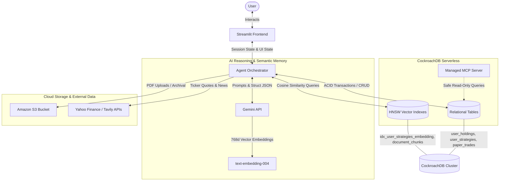
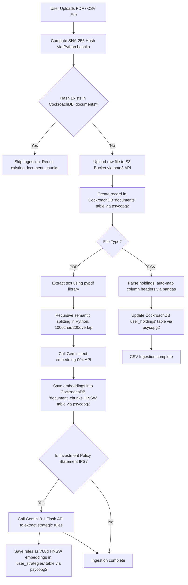

# MarketPulse AI - Autonomous Financial Research Sentinel

MarketPulse AI is an autonomous, context-aware financial research sentinel. It unifies quantitative portfolio holdings (relational data) with qualitative investment strategies (vector embeddings) and external documents (PDF earnings transcripts / filings) to deliver real-time compliance auditing, stress-testing, and automated dual-perspective debates.

---

## System Architecture

The following Mermaid diagram illustrates the interaction between the User, the Streamlit frontend, the Agent Orchestrator, CockroachDB Serverless, Amazon S3, and external AI/data services:



---

## Core Tool Integrations & Agentic Workflows

At runtime, the agent chatbot integrates and coordinates interactions with multiple specialized tools and databases to fulfill user research requests:

### 1. CockroachDB Serverless (Relational & Vector Search)
- **HNSW Vector Search**: The agent chatbot queries 768-dimensional strategy vectors and PDF document chunks stored in CockroachDB Serverless. It runs runtime cosine similarity searches (`hnsw (embedding vector_cosine_ops)`) to retrieve contextually relevant strategy rules and earnings chunks to construct prompt context (RAG).
- **Relational Tables**: The chatbot reads and updates user portfolio holdings, strategy rules, and sandbox positions transactionally.
- **Row-Level TTL (Time-To-Live)**: CockroachDB automatically prunes cached event news and research audit logs after 30 days, keeping the relational footprint clean.

### 2. CockroachDB Managed MCP Server
- **Schema & Query Audits**: The agent chatbot utilizes the Model Context Protocol (MCP) server as a read-only schema inspector at runtime. It queries metadata, inspects database tables, and verifies that database state transitions match expected schemas during strategic reasoning steps.

### 3. CockroachDB `ccloud` CLI
- **Environment Provisioning**: Used externally to provision and inspect the CockroachDB Serverless cluster endpoints. The connection strings verified via `ccloud` are configured at the application level to establish secure, SSL-encrypted connection pools.

### 4. Amazon S3
- **Document Archival**: When a PDF transcript or financial document is uploaded via the interface, the agent chatbot initiates an asynchronous ingestion worker. The worker uploads the raw file to the Amazon S3 bucket via `boto3` for permanent storage, registering the reference URL (`s3://...`) in CockroachDB, while extracting and chunking text locally.

---

## Core Application Tabs

The web frontend is divided into 4 core functional workspaces:

1. **Portfolio Overview**: Visualizes asset allocations, holding concentrations, and historical performance tracking. It handles CSV portfolio imports and parses details into relational database holdings.
2. **Research Copilot**: The conversational chat interface powered by the Gemini Agent Orchestrator. It automatically routes queries, checks active guidelines, stress tests, and runs Quant backtests.
3. **Market News Sentinel**: Displays cached stock market news linked to your holdings, automatically highlighting strategy rules violations or warnings via a real-time AI compliance check.
4. **Paper Trading Sandbox**: Allows managing up to 10 isolated sandbox portfolios with custom virtual cash balances to simulate strategy implementation and paper trade.

---

## AI Agent Capabilities

The AI Agent acts as the central intelligence engine, executing actions across three primary domains:

### 1. Context Ingestion
- **Document Processing**: Parses uploaded PDFs (filings, transcripts) using `pypdf`, recursively splits them into 1000-character semantic chunks (with a 200-character overlap), embeds them using Gemini, and indexes them in CockroachDB HNSW tables.
- **IPS Guidelines Extraction**: When an Investment Policy Statement (IPS) is uploaded, the agent uses Gemini to extract discrete qualitative rules (e.g. *"Limit tech exposure to 40%"*) and automatically embeds them into `user_strategies`.
- **Duplicate Prevention**: Computes SHA-256 hashes of files before processing to prevent duplicate embeddings and database clutter.
- **CSV Portfolio Parser**: Automatically maps columns from imported CSV files (handling common variants for symbols, quantities, and cost bases) to relational database formats.



### 2. Reasoning & Analysis

- **Dual-Agent Event Debates**: Spawns competing Gemini agents in parallel:
  - **Bull Agent**: Generates Catalysts, upside opportunities, and technical catalysts.
  - **Bear Agent**: Identifies concentration risks, macro headwinds, and strategy rule violations.
  
  ```mermaid
  graph TD
      Prompt[User Prompt: e.g. Analyze AAPL] --> Orchestrator[Orchestrator parses request via Gemini 3.1 Flash API]
      Orchestrator --> FetchData[Fetch holdings, strategy rules, news & document chunks via psycopg2, yfinance, & Tavily APIs]
      FetchData --> SearchVector[Query HNSW vector indexes via SQL cosine similarity in psycopg2]
      SearchVector --> ParallelAgents[Spawn Parallel Debate Agents via Gemini 2.5 Flash API]
      
      subgraph Parallel Agents Execution
          Bull[Bull Agent: upside catalysts, growth factors, technical indicators]
          Bear[Bear Agent: concentration risks, headwinds, strategy rule violations]
      end
      
      ParallelAgents --> Bull
      ParallelAgents --> Bear
      
      Bull --> CollectOutputs[Collect debates output]
      Bear --> CollectOutputs
      
      CollectOutputs --> Synthesizer[Orchestrator compiles debates using Gemini 3.1 Flash API]
      Synthesizer --> UI[Render side-by-side Bull vs Bear cards in Streamlit UI]
  ```

- **Natural Language Macro Stress Testing**: Models macroeconomic scenarios against portfolio allocations, checking holdings, news context, and qualitative rules to generate a multi-dimensional risk analysis.
  
  ```mermaid
  graph TD
      Prompt[User NL Scenario: e.g. What if interest rates spike?] --> Orchestrator[Orchestrator parses request via Gemini 3.1 Flash API]
      Orchestrator --> QueryDB[Query user holdings, current positions, and news context via psycopg2 & Tavily/Yahoo Finance APIs]
      QueryDB --> StressTestAgent[Stress Test Agent analyzes macro impact via Gemini 2.5/3.1 Flash API]
      StressTestAgent --> RunScenarios[Model economic shifts on sector exposures in Python]
      RunScenarios --> CompileAssessment[Generate risk indicators & mitigation rules]
      CompileAssessment --> Synthesizer[Synthesize natural language explanation using Gemini 3.1 Flash API]
      Synthesizer --> UI[Display stress-test risk report in Streamlit UI]
  ```

- **Quantitative Backtesting**: Uses historical Yahoo Finance data to backtest strategies (e.g. SMA Crossovers, RSI triggers, Bollinger Bands) on a specific ticker, reporting return metrics, Sharpe ratios, and drawdowns.
  
  ```mermaid
  graph TD
      Prompt[User Request: e.g. Run RSI backtest on TSLA] --> Orchestrator[Orchestrator parses parameters via Gemini 3.1 Flash API]
      Orchestrator --> FetchCandles[Fetch historical daily candles via Yahoo Finance yfinance API]
      FetchCandles --> ComputeIndicators[Compute quant indicators: SMA, RSI, Bollinger in pandas]
      ComputeIndicators --> RunSimulation[Simulate trade triggers over specified timeframe in Python]
      RunSimulation --> CalcMetrics[Calculate Total Return, Sharpe Ratio, Max Drawdown]
      CalcMetrics --> GenerateLog[Generate trade logs]
      GenerateLog --> Synthesizer[Orchestrator compiles explanation via Gemini 3.1 Flash API]
      Synthesizer --> UI[Render performance metrics & transaction table in Streamlit UI]
  ```

### 3. Strategy Simulation

- **Sandbox Management**: Transactionally manages virtual sub-ledger accounts, allowing users to build and run test strategies.
  
  ```mermaid
  graph TD
      Prompt[User Request: e.g. Create new sandbox Growth Portfolio] --> Orchestrator[Orchestrator parses parameters via Gemini 3.1 Flash API]
      Orchestrator --> ValidateLimit[Check active sandboxes count < 10 via SQL query]
      ValidateLimit -->|Yes| InsertSandbox[Create transaction in CockroachDB 'sandboxes' table via psycopg2]
      ValidateLimit -->|No| RaiseError[Raise limit error in Streamlit UI]
      InsertSandbox --> ConfirmUI[Display sandbox creation success card in Streamlit UI]
  ```

- **Natural Language Paper Trading**: Interprets conversational buy/sell requests (e.g., *"Buy $5000 worth of AAPL in sandbox 2"*), calculates current market pricing, verifies available sandbox cash, and executes the simulated trade.
  
  ```mermaid
  graph TD
      Prompt[User Request: e.g. Buy 20 shares of NVDA in sandbox 1] --> Orchestrator[Orchestrator parses trade details via Gemini 3.1 Flash API]
      Orchestrator --> VerifySandbox[Fetch sandbox cash balance from SQL 'sandboxes' table via psycopg2]
      VerifySandbox --> FetchQuote[Fetch real-time price quote via Yahoo Finance yfinance API]
      FetchQuote --> CalcCost[Compute total trade cost]
      CalcCost --> VerifyFunds{Available Cash >= Trade Cost?}
      
      VerifyFunds -->|Yes| SQLTx[Start SQL Database Transaction on CockroachDB via psycopg2]
      SQLTx --> UpdateCash[Update cash balance in SQL 'sandboxes' table]
      SQLTx --> UpdateHoldings[Update/insert holdings in SQL 'sandbox_positions' table]
      SQLTx --> LogTrade[Insert audit log into SQL 'paper_trades' table]
      SQLTx --> CommitTx[Commit transaction]
      CommitTx --> SuccessUI[Display simulated trade execution receipt in Streamlit UI]
      
      VerifyFunds -->|No| FailUI[Display insufficient funds warning in Streamlit UI]
  ```

---

## Conversational Agent User Guide (Testing Prompt Examples)

The agent processes natural language inputs directly inside the **Research Copilot** tab. You can test each agent capability using the following prompt examples:

### 1. Ingesting Files & Strategies
To test file and strategy ingestion, upload a PDF or CSV in the file uploader and prompt the agent:
- *"Read this earnings transcript and extract key catalysts for Apple."*
- *"Ingest this Investment Policy Statement and update my portfolio strategy memory."*

### 2. Dual-Agent Event Debates
To trigger a Bull vs. Bear debate on a stock (this queries news, strategy compliance, and returns structured opposing cards side-by-side):
- *"Should I buy Apple stock right now?"*
- *"Analyze MSFT and give me the bull/bear case."*
- *"/debate NVDA"* *(Explicit shortcut to trigger debate)*

### 3. Macro Stress Testing
To stress test your portfolio allocations against hypothetical economic situations:
- *"What happens to my portfolio if interest rates spike 50 basis points?"*
- *"How will my holdings handle a sudden tech sector selloff?"*

### 4. Quantitative Backtesting
To backtest a quantitative strategy historically (supports RSI, MACD, SMA/EMA cross, Bollinger, breakout):
- *"Run a 2-year backtest on Tesla using the RSI strategy."*
- *"Backtest a 5-year SMA crossover strategy on Microsoft."*

### 5. Sandboxes & Paper Trading
To interact with simulated sub-ledgers and execute trades conversationally:
- *"Create a new sandbox named 'Tech Only' with $100,000 starting cash."*
- *"Show me all my active strategy sandboxes."*
- *"Buy 20 shares of NVIDIA in sandbox 1."*
- *"Sell all my shares of Apple in sandbox 'Tech Only'."*

---

## Prerequisites & Setup

### 1. Requirements & Dependencies
- **Python**: version `3.10` or higher.
- **Package Manager**: `uv` (Recommended) or `pip`.
- **API Access**: 
  - Google AI Studio (Gemini API Key)
  - AWS Account & IAM credentials (S3 read/write permissions)
  - Tavily Search API (Optional, for news fallback)
  - Alpaca Paper Trading (Optional, for sandbox trading)

Install the Python dependencies:
```bash
uv pip install -r requirements.txt
```

### 2. Environment Configuration
Copy the template configuration file:
```bash
cp .env.example .env
```
Fill out the variables in `.env`:
```env
# CockroachDB Connection String
COCKROACH_DATABASE_URL=postgresql://<username>:<password>@<host-domain>:26257/defaultdb?sslmode=verify-full

# Gemini API Credentials (https://aistudio.google.com)
GEMINI_API_KEY=your_gemini_api_key_here

# Amazon S3 Storage Credentials
AWS_ACCESS_KEY_ID=your_aws_access_key_id_here
AWS_SECRET_ACCESS_KEY=your_aws_secret_access_key_here
AWS_REGION=us-east-1
AWS_S3_BUCKET=earnings-transcripts
# Optional: For S3-compatible alternatives (e.g. MinIO, Cloudflare R2, LocalStack)
# AWS_S3_ENDPOINT_URL=https://your-endpoint.com

# Tavily Search API key (Optional fallback)
TAVILY_API_KEY=your_tavily_api_key_here

# Alpaca Paper Trading Credentials (Optional)
ALPACA_API_KEY=your_alpaca_api_key_here
ALPACA_SECRET_KEY=your_alpaca_secret_key_here
ALPACA_PAPER=True
```

---

## Running the Application

### 1. Verify Connections
Before launching the frontend, run the connection verification suite to test database, Gemini, S3, and news APIs connection states:
```bash
python verify_connections.py
```
A successful connection run will output:
```text
==================================================
   MarketPulse AI Connection Verification Suite   
==================================================

Testing CockroachDB Connection...
  [+] CockroachDB Connected successfully!
Testing Gemini API Connection...
  [+] Gemini API Connected successfully! Embedding generated with 768 dimensions.
Testing Amazon S3 Connection...
  [+] Amazon S3 Connected successfully! Bucket 'earnings-transcripts' is accessible.
Testing Tavily Search API Connection...
  [+] Tavily Search API Connected successfully!

==================================================
   ALL CONNECTIONS SUCCESSFUL! Ready to proceed.  
==================================================
```

### 2. Run Streamlit Frontend
Launch the Streamlit web server:
```bash
streamlit run app.py
```
Access the application dashboard at `http://localhost:8501`.
